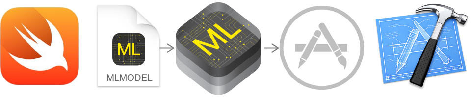

# Demo Swift CoreML Vision API

This demonstration shows:

  * [Swift](http://swift.org) programming language with
    [Apple](http://apple.com)
    [Xcode](https://developer.apple.com/xcode/)
    [iOS](http://www.apple.com/ios/)

  * How to create a view that shows "Hello World" on the screen.

To use this project:

  * You can clone this repo.

  * Or you can create the project yourself by using this README that explains how to do it.

## Create the project

Launch Xcode. 

Choose "File" → "New" → "Project". 

You see the dialog "Choose a template for your new project".

  * Choose the "iOS" radio button.

  * Choose the "Single View Application" icon.

  * Tap the button "Next".

You see the dialog "Choose options for your new project".

  * For "Product Name", type "Demo Swift CoreML Vision API".

  * For "Organization Name", type anything you want. Typically this is your company's name, or team's name, or similiar. For example, "Example Company".

  * For "Organization Identifier", type anything you want. Typically this is your company's reverse domain name. For example, "com.example".

  * Tap the button "Next".

You see the file chooser.

  * Choose where to save your project.

  * Tap the button "Create".

  * Xcode creates the project.

## Sign the project

If Xcode shows a "Signing" area with a "Status" alert icon, here's how to solve it.

  * Xcode may show a message such as "Signing for "Demo Swift Hello World" requires a development team. Select a development team in the project editor."

  * In the same "Signing" section, choose the "Team" dropdown, and choose your Apple ID.

  * If there's no Apple ID, then you need to add yours: Xcode → Preferences → Accounts → the "+" button → Add Apple ID

## Run the project

Run the project for the first time.

  * Xcode → Product → Run

  * This is simply to verify that the project runs so far.

The Simulator launches.

  * The Simulator shows a blank screen.

  * Quit the Simulator and go back to using Xcode.

## Create the project

Use this: https://medium.freecodecamp.org/ios-coreml-vision-image-recognition-3619cf319d0b

Delete the storyboard:

  * Delete the file "Main.storyboard".

  * Select the file "Info.plist".

  * The main area shows "Information Property List".

  * One entry is "Main storyboard file base name" and set to "Main".

  * Delete the entry.

Add frameworks for "AVFoundation", "CoreML", "Vision":

  * In the project navigator, select your project.

  * Select your target.

  * Select the "Build Phases" tab.

  * Open "Link Binaries With Libraries" expander.

  * Click the + button.

  * Select your framework.

  * (optional) Drag and drop the added framework to the "Frameworks" group.

Add the machine learning model:

  * Download the model.

  * Add the model to your Xcode project by dragging the model into the project navigator.

  * You can see information about the model—including the model type and its expected inputs and outputs—by opening the model in Xcode. The inputs to the model are the number of solar panels and greenhouses, as well as the lot size of the habitat (in acres). The output of the model is the predicted price of the habitat.

  * Xcode also uses information about the model’s inputs and outputs to automatically generate a custom programmatic interface to the model, which you use to interact with the model in your code. For a model named "Foo" with a file name "Foo.mlmodel", Xcode generates interfaces to represent the model ("Foo"), the model’s inputs ("FooInput"), and the model’s output ("FooOutput").

## Run

Run the project.

  * Xcode → Product → Run

The Simulator launches.

  * Congratulations! You're successful!
  

## Tracking

* Package: demo_swift_coreml_vision_api
* Version: 1.0.0
* Created: 2018-03-29
* Updated: 2018-03-30
* License: BSD, GPL, MIT
* Contact: Joel Parker Henderson (http://joelparkerhenderson.com)
